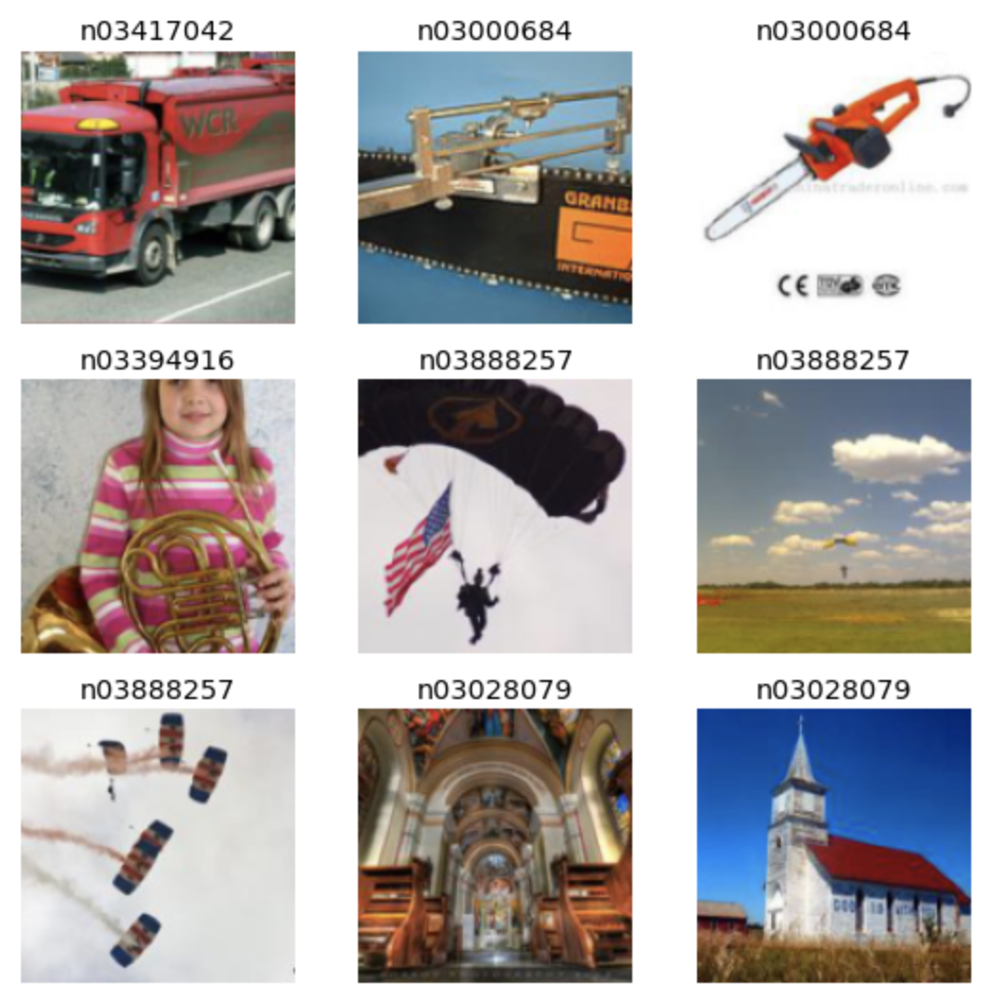

# Visualizing Activations

This repository contains a notebook for visualizing activations of a VGG-13 neural network.

### Example using activations from 20th channel of 5th layer

**Images with most activation**

**Activations from most activated images**

-   dark = less activated, light = more activated
-   it appears that this channel activation detects red edges
    

**Images with activated pixels brightened**

-   The red edges are indeed highlighted when the images are combined with the activations

    

**Optimizing random noise to generate activation**

-   Opimizing random pixels to generate a high activation yields red lines further confirming that this channel helps determine red edges

    

### Example using church class activation

-   Optimizing random pixels to activate the class that represents a church yields images with certain characteristics of churches (chapels, windows)

    
